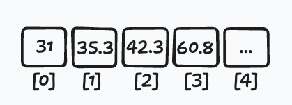
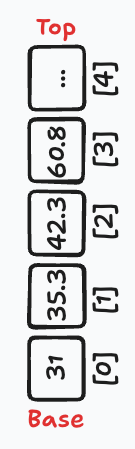
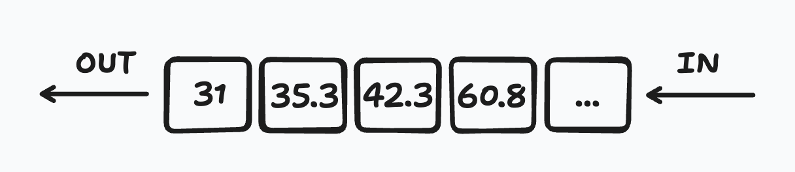
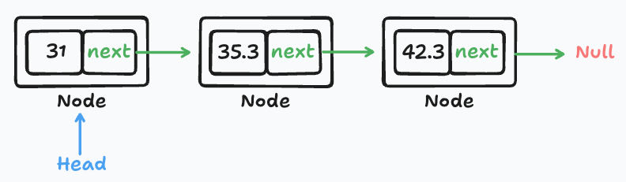
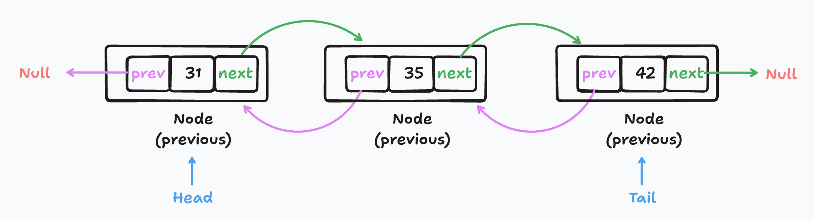

# data-structures
본 프로젝트는 자료구조를 다시 정리하는 시간을 가지기 위한 TIL의 일환입니다.

# Index
- [Array](#array)
- [Stack](#stack)
- [Queue](#queue)
- [DeQueue](#dequeue)
- [Linked List](#linked-list)
- [Set](#set)
- [Dictionary/Hash](#dictionary/hash)
- [Graph](#graph)

## Array
> 동일한 데이터 타입의 값을 연속적으로 저장한 것.

월별 날씨의 평균 온도를 일반 변수와 배열로 저장했을때 아래와 같다.
 ```javascript
 const averageJan = 31;
const averageFeb = 35.3;
const averageMar = 42.4;
const averageApr = 60.8;

// 위 코드를 배열을 사용하여 아래와 같이 관리할 수 있다.
const averageTemp = [31, 35.3, 42.3, 60.8];
 ```


### 원소 추가
- JavaScript 배열은 가변(mutable) 객체이다.
```javascript
// 방법 1.
const numbers = [1, 2, 3, 4];
numbers[4] = 5;

// 방법 2.
numbers.push(5);
numbers.push(6, 7);
```

- 배열의 마지막이 아니라 첫번째에 원소를 삽입하고 싶다면?
  - 기존에 있던 원소를 전부 우측으로 한 칸 씩 이동시키고 첫번째 원소에 삽입해야한다.
```javascript
// 방법 1.
const arr = [10, 20, 30]; // 초기 배열
const newValue = 5;       // 삽입할 값

// 배열 요소를 뒤로 이동
for (let i=arr.length - 1; i >= 0; i--) {
  arr[i + 1] = arr[i];
}

// 첫 번째 인덱스에 값 삽입
arr[0] = newValue;

console.log(arr); // 결과: [5, 10, 20, 30]

// 방법 2.
arr.unshift(-2, -4); // 결과: [-2, -4, 5, 10, 20, 30]
```

### 원소 삭제
- 마지막 원소 삭제
```javascript
const numbers = [1, 2, 3, 4];

numbers.pop(); // 4 제거
```
- 첫번째 원소 삭제
```javascript
// 방법 1.
const numbers = [1, 2, 3, 4];

for (let i=0; i < numbers.length; i ++) {
  numbers[i] = numbers[i+1];
}
```
이렇게 하면 첫번째 원소는 삭제되었지만 배열의 크기(length)는 그대로 4다.
그 말은, 배열의 값들이 덮어쓰였을 뿐 실제로 삭제한 것은 아니라는 뜻이다.
첫번째 원소를 삭제하며 길이도 제거하고 싶다면 `shift` 메소드를 이용하면 된다.

### 특정 위치에 원소 추가/삭제
- 3번째 위치에 원소 추가
```javascript
const numbers = [1, 2, 3, 4, 5, 6];

numbers.splice(3, 0, 30, 40); // 3번째 index에 30, 40 추가

console.log(numbers); // 결과: 1, 2, 3, 30, 40, 4, 5, 6
```
- 3번째 위치에서 원소 2개 삭제
```javascript
const numbers = [1, 2, 3, 4, 5, 6];

numbers.splice(3, 2); // 3번째 index 부터 2개 원소 삭제

console.log(numbers); // 결과: 1, 2, 3, 6
```

## Stack
> LIFO(Last In First Out) 컬렉션
- 스택은 항상 동일한 종단점에서 추가/삭제된다.
- 스택의 종단점은 Top or Base 2가지인데, 최근 자료는 Top에, 오래된 자료는 Base에 위치한다.
- JavaScript 엔진의 Call Stack이 스택 자료구조 기반이다.<br/><br/>
  

### 구현단계
- 구현해야할 메서드
  - push(items): Top에 원소(들)을 추가한다.
  - pop(): Top에 있는 원소를 반환하고 삭제한다.
  - peek(): Top에 있는 원소를 반환하되 삭제하지 않는다.
  - isEmpty(): 스택이 비어있으면 true, 비어있지 않으면 false 반환
  - clear(): 스택의 모든 원소를 삭제한다.
  - size(): 스택에 있는 원소의 개수를 반환한다. 배열의 length 프로퍼티와 동일

- **구현**
```javascript
class Stack {
  constructor() {
    this.items = [];
  }

  push(...items) {
    this.items.push(...items);
  }

  pop() {
    return this.items.pop();
  }

  peek() {
    return this.items.at(-1); // 최신 문법
  }

  isEmpty() {
    return !this.items.length;
  }

  clear() {
    this.items = [];
  }

  size() {
    return this.items.length;
  }
}
```  

- **테스트**
```javascript
const stack = new Stack();

stack.push(1,2,3); // [1, 2, 3]
stack.push(4); // [1, 2, 3, 4]

stack.pop(); // 4
stack.pop(); // 3

console.log(stack); // 결과: [1, 2]

stack.size(); // 2
stack.isEmpty(); // false
```

- 간단한 문제 - 10진수를 2진수로 변환
```javascript
function divideBy2(decNumber) {
  const stack = new Stack();
  let tempDecNumber = decNumber;
  let result = '';

  while (tempDecNumber !== 0) { // O(log N)
    const division = Math.floor(tempDecNumber % 2);

    stack.push(division); // 나머지를 스택에 삽입

    tempDecNumber = Math.floor(tempDecNumber / 2);
  }

  /* 
   * 첫 번째 루프에서 스택에 삽입된 항목 수는 log₂(decNumber)에 비례하므로, 
   * 이 루프 역시 O(log₂(decNumber))입니다.
   */
  while (!stack.isEmpty()) { // O(log N)
    result += stack.pop(); // Top부터 꺼내어 2진수 변환
  }

  return result;
}
```
시간복잡도는 O(log N) 이다.

## Queue
> FIFO(First In First Out) 컬렉션
- 새 원소는 뒤로 들어가서 앞으로 빠져나가는 구조이다.
- 따라서 마지막에 추가된 원소는 큐의 뒤에서 가장 오래 대기해야 한다.
- 큐와 스택은 원소의 추가/삭제 원리만 다를 뿐 나머지는 동일하다. <br/><br/>
  

### 구현단계
- 구현해야할 메서드
  - enqueue(items): 큐의 뒤쪽에 원소(들)을 추가한다.
  - dequeue(): 큐의 첫 번째(맨 앞) 원소를 반환하고 삭제한다.
  - front(): 큐의 첫 번째 원소를 반환하되, 삭제하지 않는다. (스택의 peek 메소드와 비슷하다.)
  - isEmpty(): 큐가 비어있으면 true, 비어있지 않으면 false 반환
  - size(): 큐에 있는 원소의 개수를 반환한다. 배열의 length 프로퍼티와 동일

- **구현**
```javascript
class Queue {
  constructor() {
    this.items = [];
  }

  enqueue(...items) {
    this.items.push(...items);
  }

  dequeue() {
    return this.items.shift();
  }

  front() {
    return this.items.at(0);
  }

  isEmpty() {
    return !this.items.length;
  }

  size() {
    return this.items.length;
  }
}
```
- **테스트**
```javascript
const queue = new Queue();

console.log(queue.isEmpty()); // true

queue.enqueue("ha"); // queue: ["ha"]
queue.enqueue("jeong"); // queue: ["ha", "jeong"]
queue.enqueue("hun"); // queue: ["ha", "jeong", "hun"]

console.log(queue); // ["ha", "jeong", "hun"]
console.log(queue.size()); // 3
console.log(queue.isEmpty()); // false

queue.dequeue(); // "ha" 반환
queue.dequeue(); // "jeong" 반환
console.log(queue); // ["hun"]
```

## Linked List
> 데이터를 노드(Node) 형태로 저장하는 선형 데이터 구조
- 각 노드는 데이터를 포함하며 다음 노드를 가리키는 포인터(또는 참조)를 가지고 있다.
- 배열은 인덱스로 원소에 바로 접근할 수 있지만, 연결 리스트는 원소를 찾기위해 Head부터 순차적으로 접근해야 한다.
  <br/><br/>
  

### 구현단계
- 구현해야 할 헬퍼 클래스(Node)
  - element: 원소
  - next: 다음 원소에 대한 포인터
- 구현해야 할 변수
  - length: 연결리스트의 총 원소 개수
  - head: 연결이 시작되는 지점
- 구현해야할 메서드
  - append(element): 연결 리스트의 맨 끝에 원소를 추가한다.
  - insert(position, element): 해당 위치에 원소를 삽입한다.
  - removeAt(position): 해당 위치의 원소를 삭제한다.
  - remove(element): 해당 원소를 삭제한다.
  - indexOf(element): 해당 원소의 인덱스를 반환한다. 미존재 시 -1 반환
  - isEmpty(): 원소가 하나도 없으면 true, 있으면 false 반환
  - size(): 원소 개수를 반환. 배열의 length 프로퍼티와 동일
  - toString(): 원소가 Node에 담겨있기 때문에 원소의 값만을 출력하기 위해 toString 메소드 재정의


- **append(element) 구현** - 연결 리스트의 맨 끝에 원소를 추가한다.
```javascript
class Node {
  constructor(element) {
    this.element = element;
    this.next = null;
  }
}
class LinkedList {
  #length = 0;
  #head = null;

  append(element) {
    const node = new Node(element);

    if (this.#head === null) { // (1) 원소가 비었을 때
      this.#head = node;
    } else {
      let current = this.#head;

      // (2) next가 null일 때까지 반복 
      while (current.next) {
        current = current.next;
      }

      // (3) next를 방금 추가한 Node로 등록
      current.next = node;
    }

    // (4) 원소의 길이 1 추가
    this.#length += 1;
  }
}
```
- (1) - 원소가 비었을 경우에는, 추가하는 원소를 연결 리스트의 head로 등록한다.
- (2) - 연결 리스트에 원소가 이미 있는 경우, 가장 뒤에 추가해야 하기 때문에 Node의 next 포인트가 null인 꼬리(tail)지점까지 접근을 반복한다.
- (3) - current가 가장 뒤의 Node로 접근했기 때문에 next 포인트를 추가할려고 한 원소를 가리키게 한다.
- (4) - 연결리스트의 원소가 추가되었기 때문에 length 프로퍼티를 1 더한다.


- **insert(position, element) 구현** - 해당 위치에 원소를 삽입한다.
```javascript
class LinkedList {
  #length = 0;
  #head = null;

  // ...(생략)

  insert(position, element) {
    // (1) 삽입 위치가 범위를 벗어남
    if (position < 0 || position > this.#length) return false;

    const node = new Node(element)
    let previous = null;
    let current = this.#head;

    // (2) 첫 위치에 삽입 시
    if (position === 0) {
      node.next = current;
      this.#head = node;
      this.#length += 1;

      return true;
    }

    for (let i = 0; i < position; i++) {
      previous = current; // (3) 삽입 위치 이전 노드
      current = current.next // (4) 삽입 위치의 기존 노드
    }

    // (5)
    node.next = current;
    previous.next = node;

    this.#length += 1;

    return true;
  }
}
```
- (1) - 삽입 위치가 범위를 벗어날 경우 false 반환
- (2) - 첫 위치에 삽입 시, 우선 신규 Node의 next가 head를 바라보게 한 뒤에 head를 신규 Node로 옮긴다. (`head` -> `New Node` -> `Existing First Node`)
- (3) - poisition이 2라고 가정했을 때, 1번 Node 를 뜻한다.
- (4) - poisition이 2라고 가정했을 때, 기존 연결 리스트의 2번 Node 를 뜻한다.
- (5) - 신규 Node의 next가 기존 2번 Node를 바라보게 하고, 1번 Node의 next가 신규 Node를 바라보게 한다. (`head` -> `index {1} Node` -> `index {2} New Node` -> `Existing index {2} Node`)


- **removeAt(position) 구현** - 해당 위치의 원소를 삭제한다.
```javascript
class LinkedList {
  #length = 0;
  #head = null;

  // ...(생략)

  removeAt(position) {
    // (1) 삭제 위치가 범위를 벗어남
    if (position < 0 || position >= this.#length) return null;

    const node = new Node(element)
    let previous = null;
    let current = this.#head;

    // (2) 첫 위치 원소 삭제 시
    if (position === 0) {
      this.#head = current.next;
      this.#length -= 1;

      return current.element;
    }

    for (let i = 0; i < position; i++) {
      previous = current; // (3) 삭제할 노드의 이전 노드
      current = current.next // (4) 삭제할 노드
    }

    // (5)
    previous.next = current.next;

    this.#length -= 1;

    return current.element;
  }
}
```
- (1) - 삭제 위치가 범위를 벗어날 경우 null 반환
- (2) - 첫 위치의 Node 삭제 시, head가 두번째 Node를 바라보게 한다. (첫번째 Node를 참조하는 곳이 없어 GC 수행)
- (3) - poisition이 2라고 가정했을 때, 1번 Node 를 뜻한다.
- (4) - poisition이 2라고 가정했을 때, 기존 연결 리스트의 2번 Node 를 뜻한다.
- (5) - 1번 Node의 next가 2번 Node의 next인 3번 Node를 바라보게 하면 2번 Node는 GC 수행되며 제거

.png)

**indexOf(element) 구현** - 해당 원소의 인덱스를 반환한다. 미존재 시 -1 반환
```javascript
class LinkedList {
  #length = 0;
  #head = null;

  // ...(생략)

  indexOf(element) {
    let current = this.#head;
    let index = -1;

    // (1)
    while (current) {
      index += 1; // (2)

      if (current.element === element) {
        return index; // (3)
      }

      current = current.next;
    }

    // (4)
    return -1;
  }
}
```
- (1) - current는 현재 위치로 전부 순회해도 없는 경우 current는 null을 가지며 반복문이 종료된다.
- (2) - 반복문을 수행할때마다 index를 1개씩 증가한다
- (3) - 인자로 받은 원소와 일치한 원소가 있으면 즉시 index를 반환한다.
- (4) - 반복문이 모두 수행됐음에도 발견된 원소가 없으므로 -1을 반환한다.

**toString() 구현** - 원소가 Node에 담겨있기 때문에 원소의 값만을 출력하기 위해 toString 메소드 재정의
```javascript
class LinkedList {
  #length = 0;
  #head = null;

  // ...(생략)

  toString() {
    let current = this.#head;
    let string = '';

    // (1)
    while (current) {
      string += current.element; // (2)
      current = current.next;
    }

    return string;
  }
}
```
- (1) - current는 현재 위치로 전부 순회해도 없는 경우 current는 null을 가지며 반복문이 종료된다.
- (2) - node의 element 값을 string 변수에 이어 붙인다.

**remove(element) 구현** - 해당 원소를 삭제한다.
```javascript
class LinkedList {
  #length = 0;
  #head = null;

  // ...(생략)

  remove(element) {
    const index = this.indexOf(element); // (1)
    return this.removeAt(index); // (2)
  }
}
```
- (1) - 먼저 구현한 indexOf 메소드를 이용해서 해당 원소의 index를 찾는다.
- (2) - 먼저 구현한 removeAt 메소드에 (1)에서 찾은 index를 이용하여 원소를 삭제하고 반환한다.

**isEmpty() 구현** - 원소가 하나도 없으면 true, 있으면 false 반환
```javascript
class LinkedList {
  #length = 0;
  #head = null;

  // ...(생략)

  isEmpty() {
    return !this.#length; // (1)
  }
}
```
- (1) - length가 0이면 true, 0이 아니면 false를 반환한다.


**size() 구현** - 원소 개수를 반환. 배열의 length 프로퍼티와 동일
```javascript
class LinkedList {
  #length = 0;
  #head = null;

  // ...(생략)

  size() {
    return this.#length;
  }
}
```

## Doubly Linked List
> 이중 연결 리스트는 이전(prev) Node, 다음(next) Node 2개의 연결정보를 갖고있다.
- 연결 리스트는 next Node로만 접근이 가능했지만, 이중 연결 리스트는 prev Node에도 접근 할 수 있다. 
- 구조는 다음 그림과 같다.
  <br/><br/>

